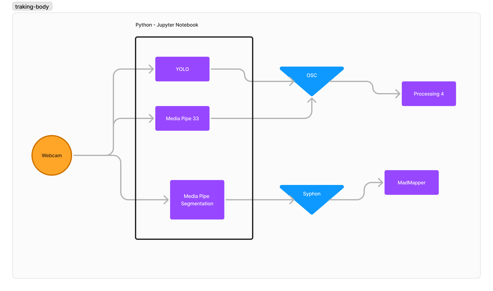

# Body Recognition and Projection Mapping

This repository explores the use of machine learning models for body recognition and dynamic projection mapping. It focuses on leveraging models to track the human body and integrate their outputs into creative environments such as Processing4 and MadMapper.

## Overview
This project has three primary approaches:



1. Comparison of MediaPipe and YOLO for Body Recognition

Tests and documents the differences between these two models, particularly in terms of accuracy, speed, and tracking quality.

2. Using MediaPipe in a Jupyter Notebook to Send OSC Messages

Keypoints extracted by MediaPipe are sent via OSC to Processing4 to render a visual representation of the human silhouette.
The goal is to create a real-time, dynamic representation of the body using keypoints.

3. Using MediaPipe Segmentation for Dynamic Masking

MediaPipe Segmentation isolates the human silhouette from the background.
The silhouette is sent via Syphon as a dynamic mask to be used in videomapping software, such as MadMapper.

## Installation
To run the Jupyter Notebook and the associated projects, ensure you have the required Python libraries in your environment:

```
conda activate aicp
```

```
pip install ultralytics mediapipe opencv-python python-osc
```

If you are using MacOS you can install Syphon dependencies:
```
pip install syphonpy PyOpenGL glfw
```


- mediapipe: For body recognition and segmentation.
- opencv-python: For image processing and video capture.
- python-osc: To send OSC messages to Processing4.
- syphonpy: For sending and receiving video streams via Syphon to external applications like MadMapper.
- PyOpenGL: For rendering graphics and working with OpenGL in Python.
- glfw: For managing OpenGL contexts, windows, and events for rendering visuals. For managing Syphon server visuals.

**Processing 4 needs oscP5 and Syphon libraries**

Go to Sketch > Import Library > Manage Libraries

- To run Syphon in Processing 4, you need the Processing 4 for Intel (x64) based instead of Apple Silicon.

## Usage

1. MediaPipe Keypoints with OSC
- Open the mediapipe-33points-osc.ipynb file in Jupyter Notebook.
- Run the notebook to extract 33 keypoints of the human body using MediaPipe.
- These keypoints are sent as OSC messages to a compatible Processing4 sketch for real-time visualization.

2. MediaPipe Segmentation for Dynamic Masking
- Open the mediapipe-segmentation-osc.ipynb file in Jupyter Notebook.
- Run the notebook to extract the body silhouette from the video feed using MediaPipe Segmentation.
- The silhouette is sent via Syphon for use in projection mapping software, such as MadMapper.

3. YOLO-based Body Tracking
- Open the yolo-osc.ipynb file in Jupyter Notebook.
- This notebook uses a YOLO model (yolo11n-pose.pt) to track the human body and send body tracking data as OSC messages.

4. Processing4 Sketches
- Navigate to the processing4/ folder for example Processing4 sketches.
- These sketches visualize OSC data received from the Jupyter notebooks.

5. Syphon Server Example based in [syphonpy](https://github.com/njazz/syphonpy/tree/master)
- Open the server-syphon-example.ipynb file in Jupyter Notebook.
- This example demonstrates how to configure and use Syphon to send visual data from python to compatible applications.

## Repository Structure

```
.
├── processing4/                       # Folder containing Processing4 sketches for visualization
│   └── (Processing4 sketches here)
├── .gitignore                         # Gitignore file
├── README.md                          # Repository documentation
├── Syphon.py                          # Python module for Syphon integration
├── mediapipe-33points-osc.ipynb       # Notebook for sending MediaPipe keypoints via OSC
├── mediapipe-segmentation-osc.ipynb   # Notebook for MediaPipe segmentation and Syphon integration
├── server-syphon-example.ipynb        # Example notebook for setting up a Syphon server
├── yolo-osc.ipynb                     # Notebook for YOLO-based body tracking with OSC
├── yolo11n-pose.pt                    # YOLO model for body tracking
```

## Notes
System Requirements: This project requires a system with a webcam for live video feed and a MacOS support for Syphon for the segmentation approach.
Recommended Hardware: For optimal performance, use a system with a dedicated GPU.

## About
This repository was created by Lina Lopes in December 2024. The project investigates how machine learning models can enable creative and dynamic uses of body recognition in artistic environments.

For more projects and inquiries, visit [Lina Lopes on GitHub](https://github.com/LinaLopes).

Happy Coding!